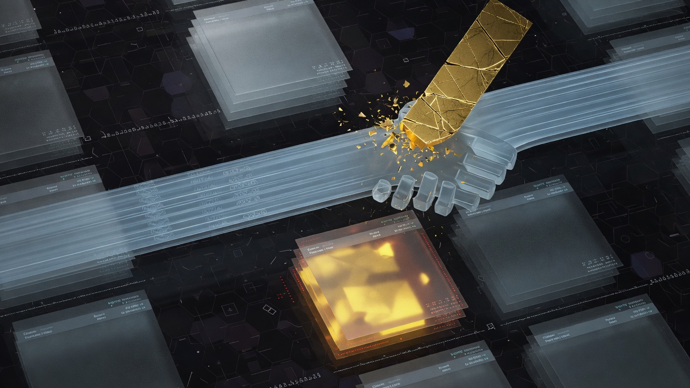

<p align="center">
  
</p>

<p align="center">
  <a href="https://abraxaslabs.tech"><strong>abraxaslabs.tech</strong></a>
  &nbsp;·&nbsp;
  <a href="https://github.com/abraxas">github.com/abraxas</a>
  &nbsp;·&nbsp;
  <a href="https://x.com/abraxas_null">@abraxas_null</a>
  &nbsp;·&nbsp;
  <a href="mailto:abraxas.null@proton.me">abraxas.null@proton.me</a>
  &nbsp;·&nbsp;
  <a href="https://github.com/abraxas/msquic-compat-vn-key-poison">msquic-compat-vn-key-poison</a>
</p>

# msquic-compat-vn-key-poison

**MsQuic** `v2.6.1` (`a01333cf`) - Microsoft

Compatible version negotiation is supposed to wait until the client can actually process a packet of the new version. This tree commits the version **and recreates Initial keys** the moment a long header looks compatible, then continues. Decrypt-fail "undo" restores the version number and leaves the keys on v2. A Handshake-type or truncated packet never even reaches that undo.

**One UDP datagram from the server 4-tuple stops a default client handshake. The process stays up. No RCE.**

| | |
|---|---|
| ID | no CVE yet |
| CWE | [CWE-345](https://cwe.mitre.org/data/definitions/345.html), [CWE-347](https://cwe.mitre.org/data/definitions/347.html), [CWE-670](https://cwe.mitre.org/data/definitions/670.html) |
| CVSS | **High: 7.5** `CVSS:3.1/AV:N/AC:L/PR:N/UI:N/S:U/C:N/I:N/A:H` |
| Product | [MsQuic](https://github.com/microsoft/msquic) |
| Affected | **v2.6.1** (`a01333cf`); still on `main` when I checked |
| Auth | unauthenticated UDP, source must be the server 4-tuple (on-path, or IP spoof of the server plus the client port) |
| License | [GNU Affero GPL v3.0](LICENSE) |
| Lab | `127.0.0.1` only |

## What an attacker can do

During a QUIC v1 handshake, send one long-header datagram sourced from the server address and port. Version is QUIC v2 (RFC 9369, wire `6b 33 43 cf`). DestCidLength is 0. Default clients use an exclusive connected UDP socket, so they accept a zero-length DCID. The library treats that as compatible version negotiation **before AEAD**, derives new Initial keys, then either never hits the decrypt-fail revert (Handshake type is deferred; truncated Initial returns FALSE first) or reverts `Stats.QuicVersion` and **leaves the keys on v2**.

The real server keeps speaking v1. The client retransmits with v2 salts. That attempt never reaches `Connected`. Other connections on the same process are untouched. This is handshake DoS, not RCE.

Off-path needs IP spoof of the server plus the client's ephemeral UDP port. On-path is enough. Exclusive binding means the attacker does not need the CID.

## How I found it

I read the 2026 GHSA wave on [microsoft/msquic](https://github.com/microsoft/msquic) first: hostname MITM ([GHSA-w5f4-fx9m-m4q7](https://github.com/microsoft/msquic/security/advisories/GHSA-w5f4-fx9m-m4q7), this tag is the cherry-pick), path-UAF RCE ([GHSA-92f5-vc22-8j33](https://github.com/microsoft/msquic/security/advisories/GHSA-92f5-vc22-8j33)), ACK underflow ([GHSA-gvvw-8j96-8g5r](https://github.com/microsoft/msquic/security/advisories/GHSA-gvvw-8j96-8g5r)). Those sinks are closed on v2.6.1.

Then packet headers, CID, version negotiation, retry, stateless reset, CIBIR. RFC 9368 compatible VN is the leftover. [`QuicConnRecvHeader`](https://github.com/microsoft/msquic/blob/a01333cf7c2659cce0ff03ef3f21e1ff15bb5b83/src/core/connection.c) sees a version mismatch, asks if it is compatible, writes `OriginalQuicVersion`, sets `CompatibleVerNegotiationAttempted`, assigns `Stats.QuicVersion`, calls `QuicCryptoOnVersionChange`, and **continues**. Comment says transport parameters will check `ChosenVersion` later. Those TPs never arrive if the handshake never decrypts.

Decrypt-fail looks like a fix until you read it:

```c
Connection->Stats.QuicVersion = Connection->OriginalQuicVersion;
Connection->State.CompatibleVerNegotiationAttempted = FALSE;
```

No second `QuicCryptoOnVersionChange`. HKDF labels stay on v2. Handshake-type packets defer (`HANDSHAKE > ReadKey=INITIAL`) and `RecvHeader` returns FALSE, so that undo never runs.

I did not need `src/tools/attack`. Seven bytes is enough.

Wrong turns already recorded: injecting at the server's listen port (the client is exclusive-connected, it will not see that); forwarding the Initial before the poison on loopback (handshake finishes first, poison arrives late); `getchar()` as the sample server's wait (Docker is not a keyboard); shallow clone with empty openssl submodule (the image has to fetch v2.6.1 and init openssl); any junk long header as the proof (non-compatible `11223344` still `Connected` - the interesting part is **compatible** v2). Theatre: a CRYPTO payload, a reverse shell, RCE. The witness is handshake outcome.

## Lab

```bash
cd lab
./run.sh
```

UDP proxy **127.0.0.1:18150** is the address the client connects to. Real `quicsample` server is **127.0.0.1:18151**. On the first client datagram the PoC sends truncated v2 Handshake `f06b3343cf0000` from the proxy socket, then forwards. Bind it to loopback.

```text
control_connected=1
inject_connected=0
negative_connected=1
inject_hex=f06b3343cf0000
SUCCESS MSQUIC-COMPAT-VN-KEY-POISON-WITNESS
```

CONTROL is forward-only and must `Connected`. NEGATIVE injects `f0112233440000` first and must still `Connected`. INJECT is the only phase that dies.

## The fix

Do not call `QuicCryptoOnVersionChange` until the triggering packet decrypts. On every failure after a commit (`RecvHeader` FALSE **and** decrypt-fail) restore the version **and** derive keys back to `OriginalQuicVersion`. Ignore Handshake / 0-RTT as compatible-VN triggers. Only a decryptable Initial of the new version should switch.

## References

- [github.com/microsoft/msquic](https://github.com/microsoft/msquic) tag [v2.6.1](https://github.com/microsoft/msquic/releases/tag/v2.6.1)
- [`connection.c`](https://github.com/microsoft/msquic/blob/a01333cf7c2659cce0ff03ef3f21e1ff15bb5b83/src/core/connection.c) · [`crypto.c`](https://github.com/microsoft/msquic/blob/a01333cf7c2659cce0ff03ef3f21e1ff15bb5b83/src/core/crypto.c) · [`binding.c`](https://github.com/microsoft/msquic/blob/a01333cf7c2659cce0ff03ef3f21e1ff15bb5b83/src/core/binding.c) · [`version_neg.c`](https://github.com/microsoft/msquic/blob/a01333cf7c2659cce0ff03ef3f21e1ff15bb5b83/src/core/version_neg.c)
- Nearby patched: [GHSA-w5f4-fx9m-m4q7](https://github.com/microsoft/msquic/security/advisories/GHSA-w5f4-fx9m-m4q7) · [GHSA-92f5-vc22-8j33](https://github.com/microsoft/msquic/security/advisories/GHSA-92f5-vc22-8j33) · [GHSA-gvvw-8j96-8g5r](https://github.com/microsoft/msquic/security/advisories/GHSA-gvvw-8j96-8g5r)
- [RFC 9368](https://www.rfc-editor.org/rfc/rfc9368.html) · [RFC 9369](https://www.rfc-editor.org/rfc/rfc9369.html)
